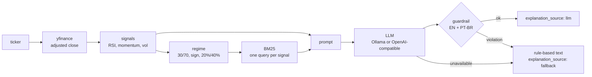

# QuantLens: an evaluated LLM analyst for Brazilian stocks (B3)

[](https://github.com/Rodrigo-Palma/quantlens/actions/workflows/ci.yml)
[](https://www.python.org/)
[](LICENSE)
[](https://github.com/astral-sh/ruff)

QuantLens takes a B3 ticker, computes RSI, momentum and volatility, retrieves
the definitions that match the current regime, and asks a local LLM to explain
the signals in plain language. A guardrail rejects advice and guarantees in
English and Portuguese; when it fires, or when the model is down, the API serves
a deterministic explanation and says so. Every quality claim below comes from an
offline eval that runs in CI.

## Measured quality

Quality numbers are printed by `make evals` (offline, a few seconds, gated in
CI); latencies by `make bench`. Intervals are 95% Wilson.

| What | System | Result |
|---|---|---|
| Faithfulness of the explanation, 180 cases (all 18 signal regimes), 5 code checks | **qwen3:32b (default)** | **180/180 = 100%** [97.9%, 100%] |
| | qwen3:32b without retrieval | 84/180 = 46.7% [39.5%, 53.9%] |
| | qwen3:8b | 175/180 = 97.2% [93.7%, 98.8%] |
| | qwen3:8b without retrieval | 103/180 = 57.2% [49.9%, 64.2%] |
| | rule-based template (baseline) | 180/180 = 100% [97.9%, 100%] |
| Checker recall: errors planted in correct outputs by another model (labels, trend) | **v0.7 checker** | **91/96 = 94.8%** [88.4%, 97.8%] |
| | v0.6 checker | 56/96 = 58.3% [48.3%, 67.7%] |
| Guardrail recall on advice, out-of-sample EN + PT-BR | **v0.6 rules** | **87/106 = 82.1%** [73.7%, 88.2%] |
| | v0.5 substring list | 15/106 = 14.2% [8.8%, 22.0%] |
| Guardrail false positives on clean text, same set | **v0.6 rules** | **2/120 = 1.7%** [0.5%, 5.9%] |
| | v0.5 substring list | 6/120 = 5.0% [2.3%, 10.5%] |
| Retrieval hit@1, 60 held-out questions from another author | **BM25** | **34/60 = 56.7%** [44.1%, 68.4%] |
| | BM25, v0.5 whitespace tokens | 28/60 = 46.7% [34.6%, 59.1%] (paired p = 0.07) |
| | v0.5 fixed query | 3/60 = 5.0% [1.7%, 13.7%] (random: 6.2%) |
| LLM call latency, warm model, n = 30, Apple M3 Max (recorded 2026-10-09, Ollama 0.35.1) | qwen3:32b | p50 7.8 s, p95 8.9 s |
| | qwen3:8b | p50 2.4 s, p95 2.7 s |
| Everything else in the request path (signals, retrieval, guardrail) | | p50 0.53 ms |

What the table supports:

- **Retrieval keeps the LLM on the system's conventions.** Without the
  retrieved definitions qwen3:32b passes 84 of 180 cases instead of 180
  (exact McNemar p = 2.5e-29): it applies its own bands, calling RSI 35 to 43
  "oversold", 60 to 64 "overbought" and a 15% volatility "moderate". A prompt
  that states the thresholds directly was not tested and might do as well.
- **The checker is measured, not assumed.** The v0.6 checker passed text with
  the momentum sign inverted, momentum and volatility swapped, or invented
  "30%"/"40%" figures. The v0.7 checker binds every number to its signal and
  sign. On 96 errors planted by gemma4 it catches 91 (the 5 misses are
  volatility labels in wordings it does not read, such as "reflects low
  risk"); on 8 mutation types of the recorded outputs it catches 99.2% to
  100%. The planted errors were all labels or trend terms: no out-of-sample
  error touched a figure, so the number and sign checks are measured only by
  the in-sample mutations. Re-scoring the 720 recorded
  outputs with it found no number, sign or direction error; it only adds
  volatility labels phrased as "price fluctuations", all in the no-retrieval
  runs.
- **The LLM does not beat the template on these checks.** qwen3:32b ties the
  rule-based baseline at 180/180: both are at the ceiling, so this eval cannot
  rank them. What the LLM adds is readable prose, which these checks do not
  measure.
- **qwen3:32b vs qwen3:8b is not a demonstrated difference.** 5 discordant
  cases, all in favor of 32b, p = 0.0625. At n = 180 the minimum detectable
  difference around a 95% pass rate is 6.4 points.
- **Retrieval on free text is weaker than the in-sample number said.** On 32
  questions written with the glossary, BM25 hits 26/32; on 60 questions from
  another author it hits 34/60. The word tokenizer's gain over the v0.5 one is
  not significant on either set (p = 0.06 and 0.07). The API does not depend
  on free text: it queries one regime at a time and gets all 54 sections right.
- **The guardrail improvement holds out of sample**, but Portuguese recall is
  43/60 = 71.7%: plural imperatives ("saiam", "vendam") are a known gap.


## Run it

```bash
make install    # uv sync --locked --extra dev
make evals      # every quality number above, offline, a few seconds
make run        # API on :8000 (uses a local Ollama model if one is running)
curl "localhost:8000/analyze?ticker=PETR4"
```

Or `docker compose up --build` (the container has a `/health` healthcheck and
reaches Ollama on the host). The compose file points at `qwen3:32b` (about 20 GB
of memory); without a reachable Ollama every response comes back with
`"explanation_source": "fallback"`.

## How it works



A response:

```json
{
  "ticker": "VALE3",
  "last_adjusted_close": 68.75,
  "rsi": 34.2,
  "momentum_20d": -0.1308,
  "annualized_volatility": 0.2713,
  "explanation": "VALE3 has been in a downtrend, with a 20-session momentum of -13.08%, indicating that the stock has lost value over the past month. The RSI(14) of 34 suggests a neutral condition, as it remains within the 30 to 70 range, reflecting a balance between gains and losses. The stock exhibits moderate volatility, with annualized swings of 27.13%, which is typical for large-cap stocks on B3.",
  "explanation_source": "llm",
  "guardrail_violations": []
}
```

`last_adjusted_close` is adjusted for dividends, JCP and splits, so returns are
comparable across distribution dates; it is not the price that traded.

Each request writes one JSON log line with a request id (also returned as
`X-Request-ID`), the latency of every stage and why a fallback happened (this
one is the cold first request of a server; warm LLM calls are in the table):

```json
{"endpoint": "/analyze", "event": "request", "explanation_source": "llm", "fallback_reason": null, "guardrail_violations": [], "latency_ms": {"fetch": 735.261, "guardrail": 1.12, "llm": 9858.963, "retrieve": 0.547, "signals": 1.236}, "llm_model": "qwen3:32b", "llm_provider": "ollama", "regime": ["neutral", "downtrend", "moderate"], "request_id": "37600ee8f40e47ef97cda5888846521f", "status": 200, "ticker": "VALE3", "total_ms": 10597.127}
```

## Evaluation

`make evals` runs the evals offline and fails CI if any recorded count gets
worse (`src/quantlens/evals/data/gates.json`). The inputs are fixed, so a gate
is the accepted count itself, not an interval: losing one case fails.
[ADR 0006](docs/adr/0006-exact-count-regression-gates.md).

**Faithfulness of the LLM output.** 180 seeded signal cases covering every
RSI x trend x volatility regime, each sent with the exact prompt the API builds.
Five code checks per output: every number is the value of the signal it is
written next to, with the right sign; the RSI and volatility labels do not
contradict the values; no trend term or direction verb contradicts the
momentum; and the guardrail passes. Each model is also recorded without the
retrieved context, to measure what retrieval contributes. Model outputs were
recorded against Ollama (`make evals-record`) into versioned cassettes with the
model digest, hardware and latency, so CI scores real generations without a
GPU. A cassette whose prompts no longer match the code fails the gate.
[ADR 0005](docs/adr/0005-faithfulness-eval-with-cassettes.md).

**The checker itself.** Every correct recorded output gets one known error at
a time (sign flip, swapped figures, invented value, invented constant, inverted
direction, wrong direction verb, swapped RSI or volatility label), and the
report gives the share each checker catches. Those mutations were designed with
the v0.7 checker, so they are in-sample; the out-of-sample number is the recall
on errors planted by `gemma4:31b-it-qat`, read by hand before scoring.

**Guardrail.** 685 labeled sentences in English and Portuguese, in three sets
used in order: a hand-written dev set, a first set from a different author
(gemma4) used to revise the patterns, and a second fresh set measured once
against the frozen patterns. Only that last set is quoted as the result.
[ADR 0003](docs/adr/0003-rule-based-guardrails-and-fallback.md).

**Retrieval.** 60 held-out free-text questions from another author and the 32
in-sample dev questions (hit@1, hit@2, MRR, exact McNemar between tokenizers),
plus all 18 signal regimes the API can produce (recall@3), against the v0.5
fixed query and a random ranking.
[ADR 0001](docs/adr/0001-bm25-over-embeddings.md).

Corrections that came from reading outputs rather than trusting scores are in
the git history and apply to every system: a fifth check (`vol_label`) was
added after the qwen3:8b outputs showed "volatility of 17.26% reflects moderate
price swings"; the negation window of the RSI check was widened after it failed
a correct "without signs of overbought or oversold"; and the v0.7 checker was
loosened five times after it failed correct text ("the 30–70 range" with an
en dash, a figure followed by ", and the RSI", "falls into the low volatility
category", "a strong positive trend", and "between overbought and oversold").

## Development

```bash
make lint fmt-check type test   # ruff, mypy, pytest (coverage floor 90%)
make evals                      # offline evals + gates
make bench                      # latency of each offline stage; prints the recorded LLM latency
make evals-record               # re-record LLM outputs (needs Ollama with qwen3:32b, qwen3:8b)
make bench-llm                  # re-measure LLM latency (warm model, idle Ollama server)
make docker                     # build the image
```

CI runs lint, format, mypy, tests, evals and the offline-stage benchmark on
Python 3.12 and 3.13, and builds the Docker image and waits for its
healthcheck. LLM latency is never measured in CI; it is recorded with
`make bench-llm` on the machine named in `latency.json`.

## Configuration

| Variable | Default | |
|---|---|---|
| `LLM_PROVIDER` | `ollama` | `ollama` or `openai` (any OpenAI-compatible `/v1/chat/completions`) |
| `LLM_BASE_URL` | `http://localhost:11434` | |
| `LLM_MODEL` | `qwen3:32b` | |
| `LLM_API_KEY` | empty | sent as a bearer token by the `openai` provider |
| `LLM_TEMPERATURE`, `LLM_SEED`, `LLM_THINK` | `0`, `0`, `false` | greedy, seeded, no reasoning trace |
| `CACHE_TTL_S`, `CACHE_MAX_ENTRIES` | `900`, `256` | reuse of a fetched series and of a generated explanation; `0` disables |

`/analyze` accepts only B3 ticker forms (`PETR4`, `TAEE11`, `PETR4F`) and returns
422 for anything else before any network call.

The `openai` provider is tested with a mocked transport and was run live
against Ollama's `/v1` endpoint, not against a hosted vendor.

## Architecture decisions

| ADR | Decision |
|---|---|
| [0001](docs/adr/0001-bm25-over-embeddings.md) | BM25 retrieval, one query per signal regime, with measured recall |
| [0002](docs/adr/0002-local-first-llm.md) | Local-first LLM behind a provider setting; greedy, seeded decoding |
| [0003](docs/adr/0003-rule-based-guardrails-and-fallback.md) | Rule-based EN + PT-BR guardrail and deterministic fallback, with a held-out measurement |
| [0004](docs/adr/0004-offline-deterministic-evals.md) | Offline eval harness (superseded: it only checked its own template) |
| [0005](docs/adr/0005-faithfulness-eval-with-cassettes.md) | Faithfulness eval of real LLM output from recorded cassettes, with a measured checker |
| [0006](docs/adr/0006-exact-count-regression-gates.md) | Regression gates on exact counts, not on interval bounds |

## Limitations

- **The faithfulness checks are a floor.** They catch invented or misplaced
  numbers, wrong signs, contradicted labels and direction claims, not vague,
  repetitive or unhelpful prose. They do not check comparisons against
  thresholds ("RSI 75, below 70" passes), labels in other wordings ("relatively
  stable", "a calm price path"), or direction verbs outside the sentence that
  holds the momentum figure. Their recall is measured only on the error types
  in the audit; the v0.7 checker was also tuned on the same recorded outputs it
  scores.
- **The retrieval ablation does not isolate retrieval from instructions.** A
  prompt that simply states the 30/70 and 20%/40% thresholds was not tested;
  it might match retrieval with less machinery.
- **Cases are synthetic.** The grid covers all 18 regimes but avoids values
  near the thresholds (volatility 18% to 24% and 36% to 42%, RSI 28 to 35 and
  65 to 72), where a label is ambiguous, and includes signal pairs that rarely
  co-occur. It says nothing about how often each regime appears in real data.
- **The guardrail is lexical.** One in five advice sentences of an unseen style
  still passes, and the test set was produced by one generator model. The
  prompt also forbids advice, so the guardrail is a second line.
- **Retrieval is near a lookup on the API path.** The API sends regime queries
  written in the glossary's own words (18/18 regimes correct by
  construction). On free text from another author BM25 gets 34 of 60 right at
  rank 1, and the held-out set came from a single generator model.
- **Signals are descriptive.** RSI, momentum and volatility are not a
  backtested strategy, and nothing here predicts returns.
- **Single ticker, synchronous, no rate limit.** Repeated requests are served
  from a 15-minute cache, but a stream of distinct valid tickers still costs
  one LLM call each; a public deployment needs a rate limit in front.

## Experimental

`scripts/finetune_lora.py` fine-tunes a small model with LoRA on rule-based
explanations. It has no evaluation result, so it is not part of the system or
of any number above.

## Disclaimer

Educational engineering project. **Not investment advice.** Uses public data only.

## Author

Rodrigo Stachlewski Palma ([GitHub](https://github.com/Rodrigo-Palma))
